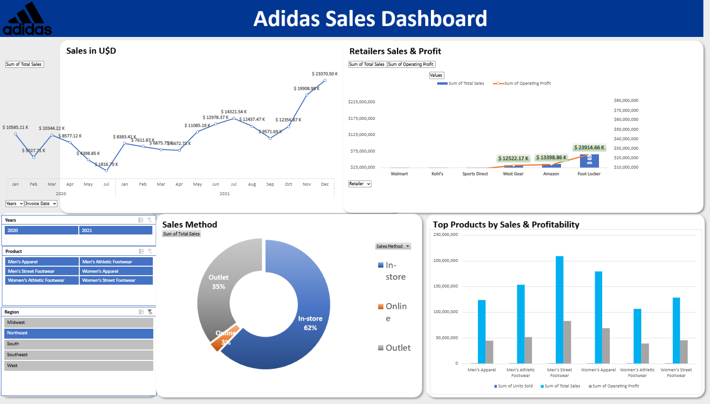
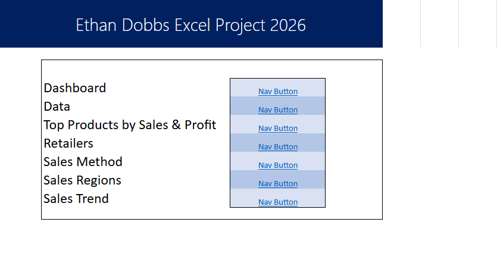
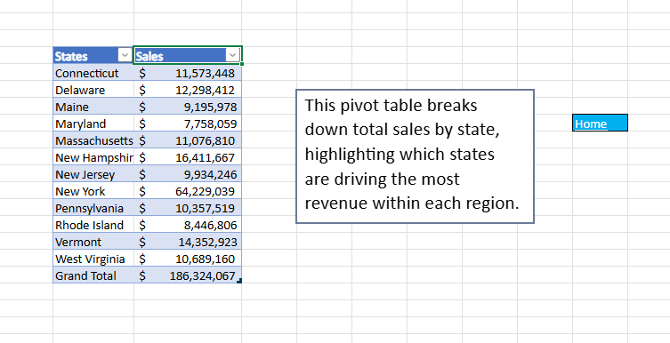

# Adidas Sales Excel Dashboard

---
## Problem Description

Raw sales data on its own doesn't tell a clear story, it's hard to see where revenue is concentrated or how retailers and regions compare. This project turns a large volume of raw Adidas sales data into a clean, easy-to-read Excel dashboard that surfaces those trends at a glance.

## Dataset Information

The dataset was sourced from Kaggle, and can be found in data/. You can find the exact dataset I used [here](https://www.kaggle.com/datasets/heemalichaudhari/adidas-sales-dataset).

## Design Rationale

The main page includes a File Index acting as a table of contents, and every page has a navigation button linking back to it.

Each pivot table page also includes a text box explaining the purpose and significance of that specific table, giving context to the data being shown.

Each tab is named directly after the pivot table it contains, so anyone navigating the file can immediately tell what question that page answers without needing to open it first. This intentional 1:1 naming between tabs and tables keeps the workbook easy to navigate, even without the nav buttons.

- Top Products by Sales & Profit: identifies which products drive volume versus which are most profitable per unit
- Retailers (Sales vs Profit): compares revenue and profitability across retail partners to spot where sales convert efficiently into profit
- Sales Method: breaks down revenue by in-store, online, and outlet channels to understand where sales are concentrated
- Sales Regions: displays geographic concentration of sales at the state level
- Sales Trend: tracks sales over time to reveal seasonal patterns and growth trends

Each pivot table was built to answer a specific business question rather than just summarize data for its own sake. Together they give a well-rounded view of where revenue comes from, what's driving it, and how it's changing over time.

## Outcome

The final product is the Excel dashboard, which you can view [here](excel/Adidas-Excel-Project.xlsx). This dashboard equips executive management with a clear, data-driven view of sales performance, allowing for more informed decision-making. Actionable steps management could take include:

- Prioritize Foot Locker and Amazon: both show the strongest sales-to-profit conversion, while other retailers lag in profitability despite volume.
- Investigate the online sales gap: online accounts for just 3% of sales versus 62% in-store, an unusually wide gap worth examining for missed growth opportunity.
- Plan for the Q4 seasonal spike: sales consistently surge in November-December each year, supporting proactive inventory and staffing decisions.

## Future Enhancements

Here are some ideas I would explore if I kept building this project further:

- I would add a profit margin analysis, calculating profit margin (Operating Profit ÷ Total Sales) to identify which retailers or products convert sales into profit most efficiently, not just which generate the most revenue.
- Create a darkmode variant to reduce eye strain.

## Contact Information

You can contact me via email at [ethan-jacob@comcast.net](mailto:ethan-jacob@comcast.net) or connect with me on [LinkedIn](https://www.linkedin.com/in/ethan-dobbs).

Thank you for reviewing my Duplicate MRN Analysis Project! I hope this project gives useful insight into how I approach data analysis.

## License

This project is licensed under the [MIT License](LICENSE).
 
